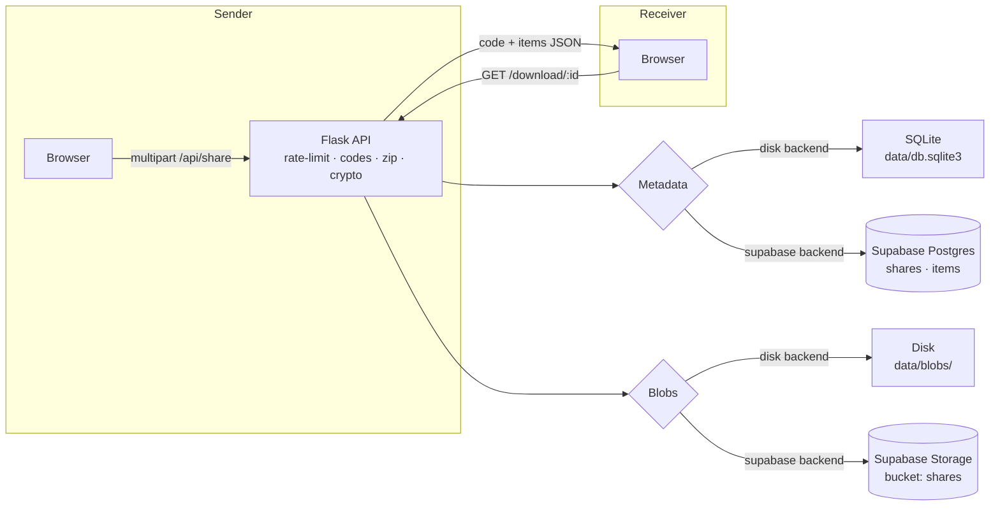

# AnyDevice Share

> Drop a file or paste text on one device, grab it on any other device with a
> short code. No accounts, no cloud drive, no leaving yourself signed in on a
> shared machine. Every code self-destructs when its timer runs out — or after a
> full download if you set it to burn.


---

## Why

Fast, ephemeral, dead-simple file transfer for people sitting on different
devices:

- **No accounts, nothing saved forever.** A code is the entire identity of a
  share — that's why lookups are rate-limited per IP and ambiguous characters
  (`0/O`, `1/I`) are banned from codes.
- **Private by default at rest.** Every share is wrapped with its own
  256-bit AES-GCM key generated by the server. The key lives only in the share
  row, is never exposed over the API, and dies with the share.
- **Burn mode.** With "self-destruct after download" on, the share is deleted
  once every item has been downloaded once (individually or via zip).
- **Pickup status.** The sender's screen shows "picked up ✓" the moment a
  receiver opens the code — no manual refresh.
- **Recent codes on this device.** The last codes you used live in
  `localStorage`, re-validated against the server on load, so nothing lingers
  after expiry.

## Features

| | |
| --- | --- |
| Drop anything | Files or pasted text/code, up to 50 MB per item and 100 MB per code |
| 5–6 character codes | Uppercase alphabet that excludes 0/O/1/I — typeable on any screen |
| QR & deep link | Scan with the receiver or share `?c=CODE` URL |
| TTLs | 5 minutes, 1 hour, or 24 hours |
| Burn | Self-destruct after the first full download |
| At-rest encryption | AES-256-GCM, server-managed per-share key |
| Live pickup | Polling `status` endpoint flips pending → viewed instantly |
| Cleanup | Expired shares purge automatically (thread or cron) |
| Rate limiting | Sliding-window per IP on code lookup, download, upload |

## Architecture



Storage and metadata sit behind two tiny interfaces — `SQLiteStore` /
`SupabaseStore` and `DiskBlobStore` / `SupabaseBlobStore` — so switching engines
is a config change, not a rewrite. The REST surface is identical either way and
blobs follow `shares/{code}/{item}/{name}`.

## Quick start (dev)

Two terminals:

```bash
# 1) Backend — http://127.0.0.1:5000
python3 -m venv .venv
.venv/Scripts/pip install -r backend/requirements.txt   # *nix: .venv/bin/pip
ANYDEVICE_CLEANUP=1 .venv/Scripts/python -m backend.app # *nix: .venv/bin/python

# 2) Frontend — http://127.0.0.1:5173 (proxies /api to the backend)
cd frontend
npm install
npm run dev
```

Open http://127.0.0.1:5173, drop a file, note the code, open the page on a
second device and type it in.

### Supabase-free, self-hosted, or hosted Supabase

The default `ANYDEVICE_BACKEND=disk` needs nothing but two folders under
`data/`. To keep data on the internet instead (the path to a free, always-on
deploy), set the engine to `supabase`:

```bash
export ANYDEVICE_BACKEND=supabase
export SUPABASE_URL="https://<ref>.supabase.co"
export SUPABASE_SERVICE_ROLE_KEY="<service_role key>"   # keep secret, env-only
export SUPABASE_DATABASE_URL="postgresql://postgres.<ref>:<pw>@aws-0-<region>.pooler.supabase.com:5432/postgres?sslmode=require"
export SUPABASE_BUCKET="shares"
.venv/Scripts/python -m backend.app
```

On first run the `shares` and `items` tables are created. Keep the Storage
bucket **private** — the backend reads it with the service-role key, and a
heartbeat thread pings Postgres every two minutes so a free-tier project never
hits the 7-day idle auto-pause.

## Configuration (env vars)

Local dev: copy `.env.example` to `.env` and fill in your values — the backend
loads it automatically (`python-dotenv`). Deployed hosts (Render, PythonAnywhere)
set the same variables in their dashboard instead; no `.env` file needed there.

| Variable | Default | Meaning |
| --- | --- | --- |
| `ANYDEVICE_BACKEND` | `disk` | `disk` (SQLite + local blobs) or `supabase` |
| `ANYDEVICE_PORT` | `5000` | API port |
| `ANYDEVICE_DATA_DIR` | `./data` | Where SQLite + blobs live (disk mode) |
| `ANYDEVICE_CLEANUP` | off | Start the periodic purge thread |
| `ANYDEVICE_FILE_MAX` | 50 MB | Per-file cap |
| `ANYDEVICE_TOTAL_MAX` | 100 MB | Total content cap per code |
| `ANYDEVICE_ITEMS_MAX` | 50 | Max items per code |
| `ANYDEVICE_LOOKUP_LIMIT` | 5/min/IP | Code-lookup rate limit (anti brute-force) |
| `ANYDEVICE_TRUST_PROXY` | off | Use `X-Forwarded-For` for rate-limit keys |
| `ANYDEVICE_ADMIN_KEY` | — | Enables `GET /api/admin/stats` (operator-only aggregate stats) |
| `SUPABASE_URL` | — | (supabase) project host |
| `SUPABASE_SERVICE_ROLE_KEY` | — | (supabase) backend service key |
| `SUPABASE_DATABASE_URL` | — | (supabase) Postgres pooler/direct URI |
| `SUPABASE_BUCKET` | `shares` | (supabase) Storage bucket |

## API

| | |
| --- | --- |
| `GET /api/health` | machine health: `{ok, service, backend}` — `503` when the metadata store is unreachable |
| `GET /api/admin/stats` | operator-only aggregate stats — needs `X-Admin-Key` header (see [ARCHITECTURE.md](ARCHITECTURE.md)); returns plain counts/averages only, never IPs/codes/filenames/content |
| `POST /api/share` | create a code + attach initial item(s) → `201 {code, items…}` |
| `POST /api/share/<code>` | append item(s) to a live code → `200` |
| `GET /api/share/<code>` | fetch share metadata + item list |
| `GET /api/share/<code>/status` | lightweight pickup poll (never marks viewed) |
| `GET /api/share/<code>/download/<id>` | stream one item (`?inline=1` → preview) |
| `GET /api/share/<code>/download-all` | zip + stream everything |

Text travels as JSON, files as `multipart/form-data` (`meta` JSON +
`text_items` JSON + file parts under `files`). TTLs: `5m` \| `1h` \| `24h`.

## Tests

```bash
.venv/Scripts/python -m pytest backend/test_api.py -q       # 40 API tests
.venv/Scripts/python -m pytest backend/test_supabase.py -q  # 4 live Supabase tests (skip if env unset)
cd frontend && npm run build                                # typecheck + production build
```

## Deploying

The free stack used by this project:

| Layer | Where |
| --- | --- |
| Backend (Flask, always-on) | PythonAnywhere free tier |
| Frontend (`dist/` static) | Cloudflare Pages / Vercel (free) |
| Metadata + blobs | Supabase free tier |

Set `VITE_API_BASE` to the deployed backend when building so the static frontend
talks to the right API, and always terminate TLS at the edge (all hosts above
do). Dev servers run over plain HTTP by design.

## Project layout

```
backend/
  app.py        Flask factory + all routes (codes, rate limits, crypto, zip)
  store.py      SQLite metadata                supabase_store.py  Postgres metadata
  storage.py    disk blobs                     supabase_storage.py  Supabase Storage
  crypto.py     AES-256-GCM at-rest helpers    codes.py / limits.py / cleanup.py
frontend/
  src/App.tsx                 single-page drop + grab flow
  src/components/             portal, attach, grab, code/QR, item previews
  src/lib/                    api client, formatting, tickers, recent-codes store
```